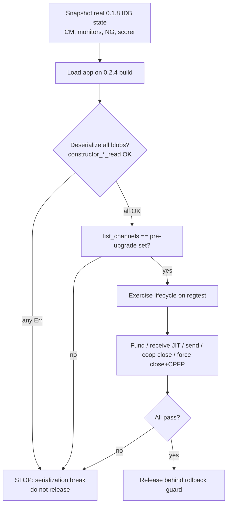

# ♻️ Upgrade `lightningdevkit` WASM bindings 0.1.8-0 → 0.2.4-0 (LDK 0.1 → 0.2)

## Overview

Bump the `lightningdevkit` npm package from `0.1.8-0` to the current `latest`, `0.2.4-0`.
The npm version tracks the underlying `rust-lightning` crate, so this is a full **LDK 0.1 → 0.2
minor** — a semver-breaking release. The bindings are auto-generated from the Rust crate, so
every Rust API/enum/serialization change propagates into our ~70-file `src/ldk/**` integration.

This touches **user funds and persisted channel state**, so the plan is conservative:
step the version, preserve a rollback path, validate deserialization of real persisted state, and
gate on manual channel-lifecycle testing before release.

**Scope in:** dependency bump, all compile-breaking API changes, event/enum migrations, config
audit, serialization/round-trip validation, WASM asset copy step, rollback plan.
**Scope out:** adopting new 0.2 features (splicing, HTLC-hold, async payments, LSPS5, zero-fee-commitment
channels, `v2_remote_key_derivation`) — deliberately deferred because several of them permanently
break downgrade (see Risk Analysis). Also **out of scope: migrating our hand-rolled LSPS2/JIT client
onto LDK's built-in `LSPS2ClientHandler`** — that's an independent refactor (own plan), not required
by the version bump.

## Problem Statement / Motivation

- We are two minor LDK releases behind (0.1.8 → 0.1.11 → 0.2.x). Staying current gets bug/security
  fixes, spec-compliance updates (e.g. the now-required `channel_type` feature), and LSPS improvements.
- The bindings 0.2.0 release increased object cloning at the WASM boundary to fix
  object-retention/memory issues — relevant to our mobile-PWA memory profile.
- Falling further behind makes each future upgrade harder; 0.1 → 0.2 is already the biggest jump
  we'll take, so do it deliberately now.

## Current State (grounded inventory)

- **Version:** `package.json:32` → `"lightningdevkit": "0.1.8-0"`; latest npm `dist-tag` = `0.2.4-0`.
  Available path: `0.1.8-0 → 0.1.11-0 → 0.2.0-0 → 0.2.4-0`.
- **WASM copy step:** `package.json:8` `copy:wasm` copies `node_modules/lightningdevkit/liblightningjs.wasm`
  → `public/liblightningjs.wasm`, run via `predev`/`prebuild`. Must confirm the filename is unchanged in 0.2.
- **Integration size:** 70 files under `src/ldk/`; heaviest: `context.tsx` (1539 LOC), `init.ts` (878),
  `traits/event-handler.ts` (768), `traits/persist.ts` (341).
- **Network:** mainnet-only (`config.ts:26` `LDKNetwork_Bitcoin`; signet infra was removed 2026-04-15).
  → **Testing is on regtest / small-amount mainnet, NOT signet.**

## Proposed Solution

Incremental, reversible upgrade in four phases:

1. **Toolchain step (0.1.8 → 0.1.11):** patch-level, no expected API breaks. Proves the copy-wasm +
   typedef + build pipeline still works and isolates any 0.1.x regressions from the big jump.
2. **API migration (0.1.11 → 0.2.4):** bump, let `tsc` enumerate every compile break, migrate each
   against the mapped changelog items below.
3. **Serialization & runtime validation:** round-trip real persisted state; exercise full channel
   lifecycle on regtest.
4. **Release with rollback guard:** ship behind a tagged rollback build; keep downgrade-blocking
   0.2 features off.

## Technical Approach

### Mapped breaking changes → exact code sites

Each row is a confirmed or high-probability break from the LDK 0.2 changelog, cross-referenced to the
real symbols we use. Verify each against the shipped `node_modules/lightningdevkit/*.d.mts` after the bump.

| #   | 0.2 change                                                                                                                                                         | Our usage (file:line)                                                                                                                                                                                                                                     | Action                                                                                                                                                                                                                                                | Confidence                  |
| --- | ------------------------------------------------------------------------------------------------------------------------------------------------------------------ | --------------------------------------------------------------------------------------------------------------------------------------------------------------------------------------------------------------------------------------------------------- | ----------------------------------------------------------------------------------------------------------------------------------------------------------------------------------------------------------------------------------------------------- | --------------------------- |
| 1   | `Event::PendingHTLCsForwardable` **removed**; replaced by `needs_pending_htlc_processing()` + `process_pending_htlc_forwards()` polling                            | `event-handler.ts:290-297` (matches event, sets forward timer); background loop `context.tsx:1235-1237`                                                                                                                                                   | Delete the event arm; poll `channelManager.needs_pending_htlc_processing()` in the ~10s timer and call `process_pending_htlc_forwards()` when true                                                                                                    | **Confirmed**               |
| 2   | `ClosureReason::HolderForceClosed` split into finer variants; new `LocallyCoopClosedUnfundedChannel`                                                               | `event-handler.ts:715` (`isForceClose`), `:726` (`describeClosureReason`)                                                                                                                                                                                 | Replace `ClosureReason_HolderForceClosed` with the new variant(s); add `LocallyCoopClosedUnfundedChannel` string; re-map force-close detection                                                                                                        | **Confirmed**               |
| 3   | `Event::HTLCHandlingFailed` reshaped (`LocalHTLCFailureReason`, `failure_type`/`UnknownNextHop` deprecated)                                                        | `event-handler.ts:659-665` (error-log only)                                                                                                                                                                                                               | Update field access to new getter names; keep log-only behavior                                                                                                                                                                                       | High                        |
| 4   | `Persist` keys on `MonitorName` rather than `funding_txo` `OutPoint` (KVStore/persister layer)                                                                     | `traits/persist.ts` `persist_new_channel` / `update_persisted_channel`; monitor key = `{txid}:{vout}` derived from `monitor.get_funding_txo()` (`init.ts:305,346,596`)                                                                                    | Confirm `Persist` trait signature in 0.2 `.d.mts`; if it now passes `MonitorName`, derive our IDB key from it while **keeping backward-compatible reads of existing `{txid}:{vout}` keys** (dual-read migration)                                      | High — **funds-critical**   |
| 5   | `pay_for_offer[_from_human_readable_name]` args moved behind `optional_params`                                                                                     | `context.tsx:872-882` `pay_for_offer(offer, quantity, amount, payerNote, paymentId, retry, maxRoutingFee)`                                                                                                                                                | Rebuild call against the new `optional_params` signature                                                                                                                                                                                              | High                        |
| 6   | `SpendableOutputDescriptor::outpoint` → `spendable_outpoint`                                                                                                       | `sweep.ts:59,106` reads bytes + `spend_spendable_outputs` (does **not** read `.outpoint`); check `event-handler.ts:371-407` persistence path                                                                                                              | Grep for any `.outpoint` getter on descriptors; rename if present. `sweep.ts` likely unaffected                                                                                                                                                       | Medium                      |
| 7   | `channel_type` feature now **required** (spec update)                                                                                                              | negotiated internally; we set anchors + scid-privacy in `user-config.ts:15,21`                                                                                                                                                                            | Likely no code change; verify JIT/LSPS2 peers still negotiate. Note in test matrix                                                                                                                                                                    | Medium                      |
| 8   | `lightning-liquidity` structs renamed to be globally unique; built-in `LSPS2ClientHandler` events expanded (`channel_open_abandoned`, failure events); LSPS5 added | **We do NOT use the built-in LSP client.** JIT/LSPS2 is hand-rolled over a raw `CustomMessageHandler` + custom `Type` messages, feature bit 729 (`lsps2/message-handler.ts:95-139`). No `LSPS2ClientHandler`/`LiquidityManager` import anywhere in `src/` | **Insulated** — the built-in LSP handler changes don't touch our path. Only verify the primitives we DO use (`CustomMessageHandler.new_impl`, `Type.new_impl/.write`, `NodeFeatures`, `InitFeatures`, `set_optional_custom_bit`) are unchanged in 0.2 | Medium                      |
| 9   | `BumpTransactionEvent` / anchor CPFP handler surface                                                                                                               | `event-handler.ts:527-591`, `init.ts:706-711` `BumpTransactionEventHandler.constructor_new`                                                                                                                                                               | Verify constructor + `handle_event` signatures; sync vs async handler (0.2 offers `events::bump_transaction::sync`)                                                                                                                                   | Medium — **funds-critical** |
| 10  | Deserialization constructor signatures (`UtilMethods.constructor_C2Tuple_*_read`, `NetworkGraph.constructor_read`, `ProbabilisticScorer.constructor_read`)         | `init.ts:334-338,494,510-514,549-562,863-866`                                                                                                                                                                                                             | Re-verify each arg list against 0.2 `.d.mts`; these are the read-back paths for persisted state                                                                                                                                                       | High — **funds-critical**   |
| 11  | `OnionMessenger` constructor (async-payments / DNS-resolver handler args)                                                                                          | `init.ts:647-657`                                                                                                                                                                                                                                         | Verify arg list; keep `IgnoringMessageHandler` for handlers we don't use                                                                                                                                                                              | Medium                      |
| 12  | New `Event`/`ConfirmationTarget`/`PaymentFailureReason` enum members                                                                                               | `event-handler.ts` switches; `fee-estimator.ts:13-24`                                                                                                                                                                                                     | Unhandled new events fall through gracefully; add cases only where behavior needed. Ensure `switch` defaults are safe                                                                                                                                 | Low                         |

> **Method:** the authoritative break list is whatever `pnpm typecheck` reports after the bump. The table
> above is the expected set — treat any `tsc` error not covered here as a new finding and add it.

### Preserved workarounds to re-validate (from `docs/solutions/`)

- **u128 encode/decode asymmetry** (`ldk-wasm-encode-uint128-asymmetry.md`): `bdk-signer-provider.ts`
  generates 32 random bytes directly for `generate_channel_keys_id` instead of round-tripping the
  broken u128 path. **Check if 0.2 fixes the asymmetry; if so, the workaround may be removable — but
  only after explicit test.** Do not remove speculatively.
- **`Persist` sync-vs-async contract** (`ldk-wasm-foundation-layer-patterns.md`,
  `ldk-trait-defensive-hardening-patterns.md`): must still return `ChannelMonitorUpdateStatus_InProgress`
  for fire-and-forget IDB writes and call `channel_monitor_updated()` on completion. Confirm the
  status enum + callback signature are unchanged (or migrate if 0.2 moves to async `KVStore`).
- **`get_node_id()` returns raw `Uint8Array`** (`ldk-wasm-write-vs-direct-uint8array.md`): verify the
  wrapper-vs-direct byte-return pattern is unchanged for peer-matching code.
- **LSPS2 JIT config** (`lsps2-jit-receive-channel-config.md`): re-confirm
  `max_inbound_htlc_value_in_flight_percent_of_channel(100)` and `accept_underpaying_htlcs(true)`
  keep the same names/semantics in 0.2 — silent HTLC rejection if they drift.
- **BDK↔LDK funding interop** (`bdk-030-upgrade-nlocktime-and-chain-sync-consistency.md`): the
  `Event_FundingGenerationReady` → BDK-built funding tx path (`event-handler.ts:437-517`) is the most
  interop-sensitive spot; test channel funding first.

### UserConfig audit (`user-config.ts`)

Confirm each still exists with identical semantics in 0.2: `set_manually_accept_inbound_channels`,
`set_negotiate_scid_privacy`, `set_negotiate_anchors_zero_fee_htlc_tx`,
`set_max_inbound_htlc_value_in_flight_percent_of_channel(100)`, `set_trust_own_funding_0conf`,
`set_force_announced_channel_preference(false)`, `set_accept_underpaying_htlcs(true)`.
**Do NOT set** `enable_htlc_hold` or `v2_remote_key_derivation` (downgrade-blocking — see risks).

### State-read validation flow

### Implementation Phases

#### Phase 1 — Toolchain step (0.1.8 → 0.1.11)

- `pnpm add lightningdevkit@0.1.11-0`; run `pnpm copy:wasm`, `pnpm typecheck`, `pnpm test`, `pnpm build`.
- Confirm `liblightningjs.wasm` still exists at the copy source path and app boots.
- Success: green build/tests on 0.1.11 with zero code changes (or trivial ones).

#### Phase 2 — API migration (0.1.11 → 0.2.4)

- `pnpm add lightningdevkit@0.2.4-0`; run `pnpm copy:wasm`.
- Run `pnpm typecheck` → capture the full break list; work the mapped table above until clean.
- Priority order: (1) `event-handler.ts` events/closure reasons, (2) `context.tsx` payment calls +
  background loop, (3) `init.ts` deserialization constructors, (4) `persist.ts` monitor keying,
  (5) `sweep.ts`, (6) `lsps2/`.
- Update unit tests that assert on migrated symbols (`event-handler.test.ts`, `persist.test.ts`,
  `jit-failover.test.ts`, `fee-estimator.test.ts`, `user-config.test.ts`, `init-recovery.test.ts`).
- Success: `pnpm typecheck`, `pnpm test`, `pnpm build` all green.

#### Phase 3 — Serialization & runtime validation

- **Round-trip:** capture a real 0.1.8 IDB export (CM + monitors + network graph + scorer) from an
  existing wallet; boot the 0.2.4 build against it; assert every `constructor_*_read` returns `_OK`
  and `list_channels()` matches the pre-upgrade set.
- **Lifecycle (regtest / small-amount mainnet):** peer connect + reconnect; LSPS2 JIT receive across
  amounts (incl. the 5,000-sat gate); outbound BOLT11 send; cooperative close; force-close +
  anchor CPFP (`Event_BumpTransaction`); spendable-output sweep; payment history survives reload.
- **Perf:** watch memory on mobile given 0.2.0's extra boundary cloning.
- Success: state-read flow (diagram) passes end-to-end.

#### Phase 4 — Release with rollback guard

- Branch `chore/upgrade-lightningdevkit-0-2` (per branch-before-commit rule); PR; wait for CI green;
  pause for explicit user approval before merge (never auto-merge).
- Tag the last 0.1.8 commit as a rollback build; document the downgrade procedure and its limits.
- Keep all downgrade-blocking 0.2 features **off**.

## Alternative Approaches Considered

- **Direct 0.1.8 → 0.2.4 in one bump (skip 0.1.11):** faster, but conflates a patch regression with the
  breaking jump. Rejected — the 0.1.11 step is cheap insurance and isolates failures.
- **Jump straight to adopting 0.2 features (splicing, HTLC-hold, LSPS5):** rejected for this change —
  several permanently break downgrade and expand scope/testing surface. Track separately.
- **Stay on 0.1.8:** rejected — accruing upgrade debt; misses spec-required `channel_type` and memory fixes.

## System-Wide Impact

### Interaction Graph

`ChannelManager.process_events()` (`context.tsx:1237`) → `EventHandler.handle_event` (`event-handler.ts`)
→ per-event side effects: IDB writes (payment history, spendable outputs, funding-tx map), BDK funding-tx
construction (`Event_FundingGenerationReady`), anchor CPFP via `BumpTransactionEventHandler`, peer
reconnection (`Event_ConnectionNeeded`). The removal of `PendingHTLCsForwardable` (#1) moves forwarding
from event-driven to poll-driven in the ~10s timer — a control-flow change, not just a rename.

### Error & Failure Propagation

LDK traits are sync boundaries bridged to async browser I/O. The `Persist` contract
(`InProgress` + later `channel_monitor_updated()`) and `Broadcaster` retry/backoff must survive the
upgrade unchanged or funds are at risk. Any change to `ChannelMonitorUpdateStatus` enum or the async
`KVStore` direction (#4) forces a trait-adapter rewrite.

### State Lifecycle Risks

Monitor storage keys (#4) must stay locatable across the upgrade: if 0.2 changes how we key monitors,
existing `{txid}:{vout}` entries must still be read (dual-read) or channels become invisible. A failed
deserialization (#10) mid-startup could orphan channel state — hence the hard STOP in the validation flow.

### API Surface Parity

Two payment entry points exist (BOLT11 via `send_payment` + `payment_parameters_from_invoice`; BOLT12 via
`pay_for_offer`). The `pay_for_offer` signature change (#5) must not be applied to only one path; verify
both Send flows still compile and route.

### Integration Test Scenarios

1. Boot 0.2.4 against real 0.1.8-persisted state → all channels present, no deserialize errors.
2. LSPS2 JIT receive after upgrade → 0-conf channel accepted, HTLC claimed (config #7/#8 intact).
3. Force-close an existing channel post-upgrade → `Event_BumpTransaction` fires, CPFP builds (#2/#9).
4. Send BOLT11 + pay BOLT12 offer post-upgrade → both routes succeed (#5).
5. Reload mid-forwarding → poll-driven `process_pending_htlc_forwards` still resolves HTLCs (#1).

## Acceptance Criteria

### Functional

- [x] `package.json` pins `lightningdevkit` `0.2.4-0`; lockfile updated; `copy:wasm` copies the 0.2 `liblightningjs.wasm` (filename unchanged).
- [x] `pnpm typecheck`, `pnpm test`, `pnpm build` all pass with no LDK-related errors (472 tests; also fixed the no-op typecheck script → `tsc -b`).
- [x] Every mapped break is resolved. Actual `tsc -b` break set was 26 errors across 9 files; the table's expectations held, plus newly discovered sync-variant renames (WalletSourceSync, WalletSync, BumpTransactionEventHandlerSync) and constructor-arity changes (KeysManager +v2_remote_key_derivation, ChainMonitor +EntropySource/PeerStorageKey, PeerManager +SendOnlyMessageHandler).
- [x] `Event_PendingHTLCsForwardable` removed and replaced with `needs_pending_htlc_processing()` polling in the background loop.
- [x] `ClosureReason` handled for 0.2 (`HolderForceClosed` still exists in bindings; added `LocallyCoopClosedUnfundedChannel`).
- [x] `pay_for_offer` migrated to the `optional_params` signature; BOLT11 send migrated to `pay_for_bolt11_invoice`; both compile.
- [x] `UserConfig` audit complete; LSPS2-critical settings verified unchanged; no downgrade-blocking feature enabled (`v2_remote_key_derivation=false`, no splicing/HTLC-hold).

> **Note on the built-in LSP client:** unaffected — the JIT/LSPS2 path is hand-rolled over `CustomMessageHandler`; LDK's `LSPS2ClientHandler` is not used. Migrating to it is a separate, deferred refactor.

### Non-Functional / Quality Gates

- [ ] Real 0.1.8-persisted state deserializes cleanly on 0.2.4; `list_channels()` matches pre-upgrade.
- [ ] Full regtest lifecycle passes (fund, JIT receive incl. 5k-sat gate, send, coop close, force close + CPFP, sweep).
- [ ] Mobile memory profile acceptable under 0.2.0 boundary-cloning behavior.
- [ ] Rollback build tagged; downgrade limits documented.
- [ ] CI green; explicit user approval before merge.

## Success Metrics

- Zero funds-affecting regressions (no stuck HTLCs, no lost channels, no failed force-close CPFP).
- No increase in payment-failure rate vs. 0.1.8 baseline.
- Clean deserialization of 100% of existing persisted channel state in validation.

## Dependencies & Risks

| Risk                                                                                                         | Severity     | Mitigation                                                                                                                    |
| ------------------------------------------------------------------------------------------------------------ | ------------ | ----------------------------------------------------------------------------------------------------------------------------- |
| Serialized CM/monitor state fails to read on 0.2                                                             | **Critical** | 0.1→0.2 read is supported (only pre-0.0.116 unsupported); hard-STOP validation gate before release; keep 0.1.8 rollback build |
| Enabling a downgrade-blocking feature by accident (splicing, `enable_htlc_hold`, `v2_remote_key_derivation`) | **Critical** | Explicitly leave off in `user-config.ts`/`KeysManager`; assert in review; document                                            |
| Silent LSPS2 HTLC rejection from config drift (#7/#8)                                                        | High         | Re-verify JIT config names/semantics; regtest JIT receive test                                                                |
| Monitor-key change hides existing channels (#4)                                                              | High         | Dual-read old `{txid}:{vout}` keys; validate `list_channels()` parity                                                         |
| Anchor CPFP / `BumpTransaction` handler signature change (#9)                                                | High         | Verify constructor + sync/async handler; force-close regtest test                                                             |
| WASM filename changed in 0.2 → `copy:wasm` silently copies nothing                                           | Medium       | Verify source path in Phase 1; fail build if missing                                                                          |
| Extra boundary cloning (0.2.0) degrades mobile memory                                                        | Low/Med      | Phase 3 perf check                                                                                                            |

## Documentation Plan

- Update the LDK version references in `docs/solutions/integration-issues/ldk-wasm-foundation-layer-patterns.md`
  and `docs/solutions/infrastructure/mainnet-deployment-phased-rollout.md` (currently cite 0.1.8-0).
- Add a `docs/solutions/` entry capturing the 0.1→0.2 migration gotchas actually hit (for the next bump).
- Note the rollback procedure and downgrade-blocking-feature policy in the deployment doc.

## Sources & References

### Internal

- `package.json:8,32` — WASM copy step + pinned version
- `src/ldk/init.ts` — node assembly, deserialization constructors, monitor keys
- `src/ldk/context.tsx:1235-1237` — background timer loop (HTLC-forward polling target)
- `src/ldk/traits/event-handler.ts:290-297,659-665,711-743` — events, HTLCHandlingFailed, ClosureReason
- `src/ldk/traits/persist.ts`, `src/ldk/storage/persist-cm.ts` — Persist trait + monitor storage
- `src/ldk/sweep.ts:59,105-112` — SpendableOutputDescriptor read + spend
- `src/ldk/user-config.ts` — UserConfig fields
- `src/ldk/lsps2/message-handler.ts:95-139` — custom LSPS2 message handler
- `docs/solutions/integration-issues/ldk-wasm-foundation-layer-patterns.md`
- `docs/solutions/integration-issues/ldk-wasm-encode-uint128-asymmetry.md`
- `docs/solutions/integration-issues/lsps2-jit-receive-channel-config.md`
- `docs/solutions/integration-issues/bdk-030-upgrade-nlocktime-and-chain-sync-consistency.md`
- `docs/solutions/integration-issues/ldk-trait-defensive-hardening-patterns.md`
- `docs/solutions/infrastructure/mainnet-deployment-phased-rollout.md`

### External

- rust-lightning CHANGELOG (0.2): https://github.com/lightningdevkit/rust-lightning/blob/main/CHANGELOG.md
- ldk-garbagecollected releases (JS bindings): https://github.com/lightningdevkit/ldk-garbagecollected/releases
- rust-lightning releases: https://github.com/lightningdevkit/rust-lightning/releases
