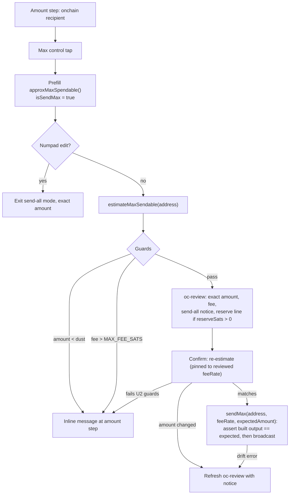

# Onchain Send All - Plan

## Goal Capsule

- **Objective:** Make "send all onchain funds" a first-class, discoverable, and accurate capability in the Send flow — a visible Max control, an amount source that reflects what a drain will actually send, estimate-time guards so failures never surface after Confirm, and review-screen transparency about the anchor reserve.
- **Authority:** This plan's Product Contract and KTDs govern scope; repo conventions (`docs/solutions/design-patterns/react-send-flow-amount-first-state-machine.md`, fund-safety invariants in `docs/solutions/integration-issues/bdk-wasm-onchain-send-patterns.md`) govern implementation style. Existing behavior outside the send-all path is not to be changed.
- **Stop conditions:** Stop and surface if the anchor-reserve branch in `sendMax` turns out to be dead code, if BDK-WASM drain APIs behave differently than `bitcoindevkit.d.ts` declares, or if any change would alter the lightning payment path.
- **Execution profile:** Standard code plan; four dependency-ordered units; unit tests in `src/pages/Send.test.tsx` are the primary proof.

---

## Product Contract

### Summary

Zinqq already has a working send-max path: tapping the unlabeled "₿X available" text on the amount step sets `isSendMax`, the exact fee-subtracted amount is recomputed at review via `estimateMaxSendable`, and Confirm dispatches `sendMax` (true `drain_wallet` with no channels open; balance minus the 10,000-sat anchor reserve otherwise). This plan does not rebuild that pipeline. It closes the gaps that keep it from being a real feature: the affordance is invisible, the prefilled amount overstates reality (it uses the unified total, which includes lightning and untrusted-pending funds), sub-dust and over-fee-ceiling outcomes fail on the error screen after Confirm instead of at the amount step, and the review screen says nothing about send-all mode or the withheld reserve.

### Problem Frame

A user who wants to move all their onchain funds today has no visible way to do it — the tap target is undiscoverable, and when found, it prefills a number that can exceed what the wallet can actually send by the entire lightning balance plus untrusted pending funds plus reserve plus fee. Failure modes that are knowable at estimate time (dust, fee ceiling) instead surface after the user has committed. For a fund-movement flow, overstating and late-failing erode exactly the trust the wallet needs.

### Requirements

**Discoverability and accuracy**

- R1. The amount step shows a visible, labeled Max control for onchain recipients; tapping it enters send-all mode, and any numpad edit exits it.
- R2. The send-all prefill reflects confirmed plus trusted pending, minus the anchor reserve when channels are open; the spendable figure displayed on the Max control reflects confirmed plus trusted pending. Neither ever includes lightning or untrusted-pending balance.
- R3. The review screen in send-all mode states that all available onchain funds are being sent, shows the exact fee-subtracted amount and fee from `estimateMaxSendable`, and — when channels are open — discloses the withheld reserve amount.

**Guards and correctness**

- R4. Send-all outcomes knowable at estimate time surface at the amount step, before review: an estimated amount below the recipient script's dust threshold (`minimal_non_dust()` — 294 sats for P2WPKH, 546 for legacy P2PKH) and a fee above the `MAX_FEE_SATS` ceiling each produce a friendly inline message instead of a post-Confirm error screen — including when the drain build itself throws before an amount is computed.
- R5. Confirm never broadcasts an amount different from the reviewed one: the verified amount is enforced at the broadcast boundary, and if the confirm-time re-estimate differs (e.g., the reserve branch flipped because a channel opened or closed), the flow returns to a refreshed review instead of broadcasting.
- R6. Existing precedence is preserved: a BIP21 URI with an embedded amount overrides send-all mode, and the exact amount is always recomputed at review.

### Scope Boundaries

- **Deferred to Follow-Up Work:** per-type Max for lightning/LNURL recipients (min of outbound capacity and LNURL max); fixing or removing the legacy label-tap affordance for lightning recipients (today it prefills the unified total and fails late); calling `estimateMaxSendable` on Max tap for an exact numpad figure.
- **Non-goals:** changing the anchor-reserve policy or amount; fee-rate selection UI; any lightning drain capability; renaming — the word "sweep" is reserved in this project for LDK force-close output recovery and must not appear in this feature's code or copy.

---

## Assumptions

Headless-run scope bets, made without user confirmation:

- "Send all" is interpreted as gap-closing the existing hidden send-max path, not building a new transaction pipeline.
- Lightning send-all is out of scope; the request named onchain funds specifically.
- The Max prefill shows the approximate spendable figure (confirmed + trusted pending − reserve) and the exact figure appears at review, preserving the recompute-at-review architecture. Exactness-on-tap is deferred.
- The spendable figure shown on the Max control subtracts nothing beyond untrusted-pending/lightning; the reserve is subtracted in the Max prefill and disclosed at review.
- The anchor reserve stays. The 2026-07-25 zero-reserve-LSP direction concerns receive-side channel reserves; `ANCHOR_RESERVE_SATS` is the onchain anchor-CPFP reserve needed for force-close fee bumping regardless of LSP policy.
- Numpad edit after Max keeps today's clear-the-flag behavior; the Max control visually toggles off.

---

## Planning Contract

### Key Technical Decisions

- **KTD1 — Reuse the existing drain pipeline.** All work lands on `estimateMaxSendable`/`sendMax` and the shared `buildSignBroadcast` helper in `src/onchain/context.tsx`. No parallel build/sign/broadcast path. Fixes to invariants (changeset persisted only after broadcast, estimation PSBTs discarded via `take_staged()`, sync paused around build/sign/broadcast, reviewed fee rate passed to send) stay in one place.
- **KTD2 — Spendable amount comes from the onchain module, not the page.** The reserve logic (channels open → subtract `ANCHOR_RESERVE_SATS`) already lives inside `context.tsx`. Expose a small ready-state helper (e.g., `approxMaxSpendable(): bigint`, clamped at 0) rather than duplicating reserve arithmetic in `Send.tsx` from `config.ts` plus channel state.
- **KTD3 — Guards run at estimate time.** Dust floor and `MAX_FEE_SATS` are checked when `estimateMaxSendable` runs (entering review), mirroring the ceiling check `buildSignBroadcast` already enforces. Post-Confirm is the wrong place to fail on a knowable condition.
- **KTD4 — Drift guard enforced at the broadcast boundary.** `handleOcConfirm` re-estimates for send-all (pinned to the reviewed fee rate); any amount difference routes back to `oc-review` with fresh numbers and a notice. The reviewed amount also travels into `sendMax(address, feeRate, expectedAmountSats)`: the reserve-branch internal estimate reuses the passed fee rate, and inside `buildSignBroadcast`'s sync-paused section the built transaction's drain/recipient output is asserted equal to `expectedAmountSats` before signing — on mismatch, staged changes are discarded and a typed drift error routes back to a refreshed review. The page-level check supplies the refreshed review numbers; the broadcast-layer assert is what makes R5 structural rather than timing-based.
- **KTD5 — Reserve disclosure is data-driven.** `MaxSendEstimate` grows a `reserveSats` field (0 when no channels open) so the review screen renders the disclosure from the estimate instead of hardcoding 10,000.
- **KTD6 — Max control is onchain-only.** It renders only when the classified recipient is onchain. Lightning recipients keep today's behavior untouched (improvement deferred).

### High-Level Technical Design

### Risks

- **Fund-safety adjacency.** `sendMax` is audited, safety-critical code (see `docs/solutions/security-issues/mainnet-fund-safety-audit-2026-03.md`). Changes must keep the anchor-reserve branch and all four drain invariants intact.
- **BDK-WASM builder semantics.** Every `TxBuilder` method consumes `self`; always chain (`build_tx().drain_wallet().drain_to(...).fee_rate(...).finish()`), never reuse a builder or argument (`docs/solutions/integration-issues/bdk-wasm-txbuilder-consumes-self.md`).
- **Reserve-branch fee drift.** With channels open, `sendMax` sends a fixed amount with change, so the final fee can differ slightly from the drain estimate. Existing, accepted; review copy may hedge but behavior doesn't change.

---

## Implementation Units

### U1. Spendable-amount helper and visible Max control

- **Goal:** A labeled Max control on the amount step for onchain recipients, prefilling an accurate onchain-spendable approximation.
- **Requirements:** R1, R2, R6.
- **Dependencies:** none.
- **Files:** `src/onchain/onchain-context.ts`, `src/onchain/context.tsx`, `src/pages/Send.tsx`, `src/pages/Send.test.tsx`.
- **Approach:** Add a ready-state helper on the onchain context (e.g., `approxMaxSpendable(): bigint`) returning confirmed + trusted pending − current anchor reserve, clamped at 0 (KTD2). In `Send.tsx`, replace the onchain "available" label with a single Max control that is the one tap target — it displays the spendable figure (e.g., "₿X available · Max") — rendered on the amount step only for onchain recipients and styled per existing button conventions (Tailwind tokens, no component library). Tapping it prefills the numpad with the helper value (spendable minus reserve) and sets `isSendMax`; any numpad key clears the flag (existing behavior at Send.tsx:146–150). Interaction states: default (label plus spendable figure), active/send-all (visually distinct — accent fill or equivalent, obviously deactivate-able), disabled (zero spendable; follow the existing `disabled:opacity-30`/`disabled:cursor-not-allowed` convention used on the Numpad Next button). Lightning recipients: no Max control; their existing label untouched.
- **Patterns to follow:** state-machine conventions in `docs/solutions/design-patterns/react-send-flow-amount-first-state-machine.md`; `handleApproxSendMax` (Send.tsx:155–166) is the affordance being replaced.
- **Test scenarios:**
  - Onchain recipient, spendable 50,000 sats, no channels: Max tap prefills 50,000 and sets send-all mode.
  - Channels open, spendable 50,000 incl. reserve: the control displays 50,000; Max tap prefills 40,000 (reserve subtracted via helper).
  - Numpad keypress after Max: send-all mode exits, control deactivates, digits edit normally.
  - Zero spendable (or untrusted-pending-only balance): Max control disabled; tap does nothing and no BDK error surfaces.
  - Lightning (bolt11) recipient: no Max control rendered; existing label behavior unchanged.
  - BIP21 URI with embedded amount: amount step skipped, send-all mode never set (existing `effectiveIsSendMax` precedence at Send.tsx:347 still covered by a test).
- **Verification:** unit tests above pass; manual flow shows the control for onchain recipients only.

### U2. Estimate-time guards: dust floor and fee ceiling

- **Goal:** Send-all failures knowable at estimate time surface as friendly inline messages at the amount step, never after Confirm.
- **Requirements:** R4.
- **Dependencies:** none (parallel with U1).
- **Files:** `src/onchain/context.tsx`, `src/pages/Send.tsx`, `src/pages/Send.test.tsx`.
- **Approach:** In `estimateMaxSendable`, treat a computed amount below the recipient script's dust threshold — derived via `addr.script_pubkey.minimal_non_dust()` (exposed in `bitcoindevkit.d.ts`), not a hardcoded 294 — the same as the existing ≤ 0 case ("Balance too low to cover fees" class of message), and enforce the `MAX_FEE_SATS` ceiling at estimate time (mirroring `buildSignBroadcast` at context.tsx:175–177) with a distinct "network fees are too high right now — try again later" message (KTD3). The no-channel drain build can throw before any amount is computed (a sub-dust drain output is rejected inside `finish()`), so also map builder-thrown dust/insufficient-funds errors from the estimate path to the same friendly message (extend `classifyEstimateError`, mirroring `mapSendError`'s dust mapping at context.tsx:56). In the send-max block of `processRecipientInput` (Send.tsx:358–379), surface all of these as inline amount-step errors rather than routing to review. These guards also gate `sendMax`'s internal reserve-branch estimate call.
- **Patterns to follow:** existing error mapping via `classifyEstimateError` (Send.tsx:81) and `mapSendError` (context.tsx:50).
- **Test scenarios:**
  - P2WPKH recipient, estimate resolves one sat below the script's dust threshold: user stays on amount step with the balance-too-low message; no `oc-review` entry.
  - P2WPKH recipient, estimate resolves exactly at the dust threshold: proceeds to review (boundary). Legacy P2PKH recipient at the same amount (below its higher threshold): stays on the amount step.
  - No channels, balance too small to drain (builder throws before an amount is computed): friendly balance-too-low message at the amount step, never raw BDK error text.
  - Drain fee exceeds 50,000 sats: inline fee-too-high message at amount step; no review, no broadcast.
  - Fee-estimate fetch failure: cached-default fallback path still reaches review (characterizes `fee-cache.ts` fallback; no throw).
- **Verification:** unit tests pass; the post-Confirm dust failure described in the flow analysis is no longer reproducible for any recipient address type.

### U3. Review-screen send-all transparency

- **Goal:** The review screen tells the user this is a send-all and where the withheld reserve went.
- **Requirements:** R3.
- **Dependencies:** U2 (guards shape what reaches review).
- **Files:** `src/onchain/onchain-context.ts`, `src/onchain/context.tsx`, `src/pages/Send.tsx`, `src/pages/Send.test.tsx`.
- **Approach:** Extend `MaxSendEstimate` with `reserveSats: bigint` (0 when no channels open) populated by `estimateMaxSendable` (KTD5). In the `oc-review` step, when `isSendMax`: add a "Sending all available onchain funds" notice; when `reserveSats > 0`, render a line item disclosing the withheld amount ("kept for Lightning channel safety" phrasing, formatted via `formatBtc()`); on the reserve branch, hedge the fee line ("final fee may vary slightly"). Keep the existing amount/fee/total layout (Send.tsx:861–907).
- **Patterns to follow:** existing review-screen line items; `formatBtc()` in `src/utils/format-btc.ts`.
- **Test scenarios:**
  - Send-all with channels open: review shows send-all notice, reserve line with the estimate's `reserveSats`, and fee hedge.
  - Send-all with no channels: notice shown, no reserve line, no hedge.
  - Normal (non-max) send: none of the send-all elements render.
- **Verification:** unit tests pass; reserve figure on screen comes from the estimate, not a literal 10,000.

### U4. Confirm-time drift guard

- **Goal:** Confirm broadcasts exactly what was reviewed, or shows a refreshed review instead.
- **Requirements:** R5.
- **Dependencies:** U3 (refreshed review reuses the send-all review rendering, including `reserveSats`).
- **Files:** `src/pages/Send.tsx`, `src/onchain/context.tsx`, `src/onchain/onchain-context.ts`, `src/pages/Send.test.tsx`.
- **Approach:** In `handleOcConfirm` (Send.tsx:594–596), for send-all only: re-run `estimateMaxSendable` pinned to the reviewed `feeRate` (add an optional fee-rate parameter) so fee-cache ticks don't force spurious refreshes; if the new amount differs from the reviewed amount, replace the `oc-review` step data with the fresh estimate plus a visible "amounts were updated" notice and do not broadcast (KTD4). If it matches, call `sendMax(address, feeRate, expectedAmountSats)`: the reserve-branch internal estimate reuses the passed `feeRate`, and `buildSignBroadcast` asserts the built transaction's drain/recipient output equals `expectedAmountSats` inside its sync-paused section before signing — on mismatch it discards staged changes and throws a typed drift error, which `handleOcConfirm` routes to a refreshed review rather than the error screen. If the confirm-time re-estimate throws or fails the U2 guards (sub-dust, fee ceiling), do not broadcast and do not render a guard-failing refreshed review — route back to the amount step with U2's inline messages. A second Confirm re-checks against the refreshed figures, so a mid-flight reserve flip converges rather than looping.
- **Patterns to follow:** existing `oc-review` step-data shape (`{ address, amount, fee, feeRate, isSendMax, fromStep }`).
- **Test scenarios:**
  - Re-estimate returns +10,000 sats (channel closed between review and confirm): no broadcast; review refreshed with new amount and notice.
  - Re-estimate returns −10,000 sats with `reserveSats` now positive (channel opened mid-flow): no broadcast; refreshed review shows the reserve line.
  - Re-estimate matches: `sendMax` called once with the reviewed `feeRate`; success screen shows the reviewed amount.
  - Confirm after a refresh with stable figures: broadcasts the refreshed amount.
  - Internal mismatch at the broadcast boundary: `sendMax` builds an output differing from `expectedAmountSats` — no signing, no broadcast, staged changes discarded, flow lands on a refreshed review.
  - Confirm-time re-estimate fails a U2 guard (fee ceiling exceeded during review dwell): no broadcast; user returns to the amount step with the inline fee-too-high message.
- **Verification:** unit tests pass; no code path broadcasts an amount that was never displayed.

---

## Verification Contract

| Gate       | Command             | Applies to                                                     |
| ---------- | ------------------- | -------------------------------------------------------------- |
| Types      | `pnpm typecheck`    | all units                                                      |
| Lint       | `pnpm lint`         | all units                                                      |
| Unit tests | `pnpm test`         | all units (primary proof in `src/pages/Send.test.tsx`)         |
| Formatting | `pnpm format:check` | all units and this plan file (CI prettier-checks all markdown) |
| Build      | `pnpm build`        | final                                                          |

Playwright e2e (`pnpm test:e2e`) is not required for this change; the send flow's unit-test harness (contexts injected directly, `payment-input` mocked) covers the state machine.

---

## Definition of Done

- R1–R6 each covered by at least one passing test named in the unit test scenarios.
- All four units land; no parallel drain pipeline exists; `buildSignBroadcast` remains the single broadcast path.
- The four drain invariants hold after the change: changeset persisted only after broadcast; estimation PSBTs discarded via `take_staged()`; sync paused around build/sign/broadcast; reviewed fee rate passed to send.
- No occurrence of "sweep" in new code identifiers or user-facing copy.
- All verification gates green; no abandoned or experimental code left in the diff.

---

## Sources & Research

- `docs/brainstorms/2026-03-14-onchain-send-brainstorm.md` — original send-max decision (drain via BDK).
- `docs/solutions/integration-issues/bdk-wasm-onchain-send-patterns.md` — drain invariants and the anchor-reserve branch rationale.
- `docs/solutions/integration-issues/bdk-wasm-txbuilder-consumes-self.md` — builder chaining requirement.
- `docs/solutions/design-patterns/react-send-flow-amount-first-state-machine.md` — send state-machine conventions (recipient-first; BIP21 precedence).
- `docs/solutions/security-issues/mainnet-fund-safety-audit-2026-03.md` — why drain paths are audited code.
- Code anchors: `src/onchain/context.tsx` (`estimateMaxSendable` :236–259, `sendMax` :294–337, `buildSignBroadcast` :157–), `src/pages/Send.tsx` (`handleApproxSendMax` :155–166, `effectiveIsSendMax` :347, send-max block of `processRecipientInput` :358–379, `handleOcConfirm` :594–596), `src/onchain/config.ts` (`ANCHOR_RESERVE_SATS`), `src/hooks/use-unified-balance.ts`, `src/shared/fee-cache.ts`.
