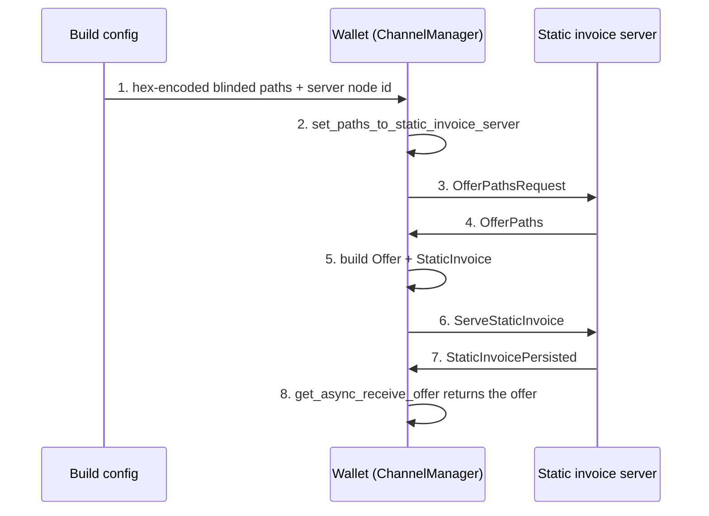
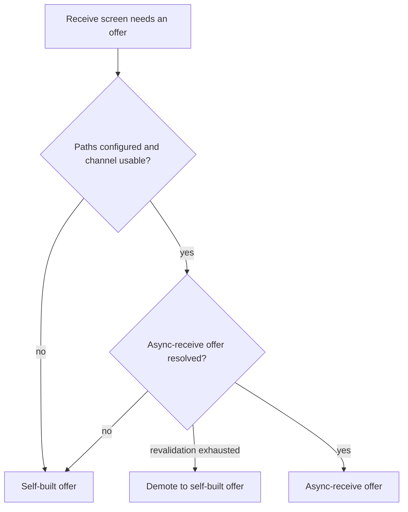

# Async Payments Recipient Role - Plan

## Goal Capsule

**Objective:** Implement the BOLT 12 async-payments recipient role so the wallet can publish an offer that a payer resolves while the wallet is closed, with the payment settling when the user next opens the wallet.

**Authority hierarchy:** This plan governs. Where it is silent, follow existing patterns in `src/ldk/`. Where the installed `lightningdevkit` bindings contradict this plan, the bindings win — record the divergence rather than working around it.

**Execution profile:** Ships behind configuration that is empty by default, and is a single-recipient (developer and test) capability until per-wallet path provisioning exists. No production behavior changes until a static invoice server's blinded paths are supplied.

**Stop conditions:**

- The deployment must serve more than one wallet from one bundle. Build-time paths encode a single `recipient_id`; multi-recipient provisioning is a scope change, not an implementation detail. Stop and report.
- The installed bindings do not expose a client-role API this plan depends on. Stop and report; do not hand-roll `StaticInvoice` construction.
- The server's paths arrive in a serialization that does not round-trip through `BlindedMessagePath.constructor_read`. Stop and report — the parser shape is a planning decision, not an implementation detail.

**Tail ownership:** The caller owns commit, PR, and CI.

---

## Product Contract

### Summary

The wallet builds its BOLT 12 offer itself, which means the offer's blinded paths terminate at the wallet. A payer resolving that offer needs the wallet online to answer the invoice request, so no payment can even be requested while the wallet is closed. This plan adds the async-payments recipient role: the wallet registers a static invoice with an always-online server, which answers invoice requests on its behalf while the wallet is away.

Scope is the recipient role only. The wallet does not run the invoice-server side, does not take the offline-payer role, and does not change the existing JIT-channel receive flow.

### Problem Frame

A browser wallet is offline most of the time. Today the only offer it can publish is one it must be awake to honor, so a shared offer is a coin flip on whether the payer catches the wallet open. The 2026-04-15 decision was to lean on the on-chain fallback and wait for the async-payments stack to mature. The wallet now ships `lightningdevkit` 0.2.4-0, whose bindings expose the full recipient-role API, and the onion-messenger wiring in `src/ldk/init.ts` already routes async-payments messages to the `ChannelManager`. The client role is the remaining gap on the wallet's side; the server side remains unconfirmed (Q1).

### Requirements

**Registration**

- R1. The wallet accepts blinded message paths to a static invoice server, and that server's node id, as build-time configuration validated at load like the existing LSP settings.
- R2. When paths are configured and a usable channel exists, the wallet registers them with its node so LDK drives the offer-building handshake with the server.
- R3. When paths are absent, registration is skipped and the current receive flow is unchanged.

**Offer surfacing**

- R4. The wallet publishes the async-receive offer as its BOLT 12 offer once it observes that offer from the node.
- R5. Until then, the wallet publishes the self-built offer, as it does today.
- R6. The published async-receive offer survives a reload without re-running the handshake.
- R7. When revalidation cannot re-resolve the async-receive offer in a later session, the wallet demotes back to the self-built offer rather than publishing an unpayable code.

**Payment settlement**

- R8. A payment made against the async-receive offer while the wallet was closed is claimed by the existing event handler when the wallet reopens, and appears in payment history.

**Diagnostics**

- R9. Each handshake stage the wallet drives — configuration parsed, paths registered, offer polled, offer published — is observable in the wallet's existing logging channel.
- R10. A runbook documents how to verify the flow against a live static invoice server.

### Key Flows

- F1. Registration handshake
  - **Trigger:** Node reaches ready state with server paths configured and at least one usable channel.
  - **Actors:** Wallet, static invoice server.
  - **Steps:** Wallet registers the configured paths; LDK sends an offer-paths request over them; the server returns paths that terminate at itself; the wallet builds an offer and a static invoice from them and sends the invoice to the server; the server confirms persistence.
  - **Outcome:** The async-receive offer becomes available from the node.
  - **Covered by:** R1, R2, R9

- F2. Offer precedence on the receive screen
  - **Trigger:** User opens the receive screen.
  - **Actors:** Wallet.
  - **Steps:** The wallet reads the async-receive offer if it has resolved, otherwise the self-built offer.
  - **Outcome:** Exactly one BOLT 12 offer is shown.
  - **Covered by:** R4, R5, R6, R7

- F3. Offline payment arrival
  - **Trigger:** A payer pays the async-receive offer while the wallet is closed.
  - **Actors:** Payer, static invoice server, wallet.
  - **Steps:** The server serves the static invoice; the payment's HTLC is held upstream; when the wallet next connects it receives notice that a held HTLC is available and returns a release message.
  - **Outcome:** The existing claimable-payment handling in `src/ldk/traits/event-handler.ts` settles the payment.
  - **Covered by:** R8

### Acceptance Examples

- AE1. **Given** no server paths are configured, **when** the node starts, **then** no registration is attempted and the receive screen shows the self-built offer.
- AE2. **Given** server paths are configured but the async-receive offer has not resolved, **when** the user opens the receive screen, **then** the self-built offer is shown.
- AE3. **Given** the async-receive offer has resolved, **when** the user opens the receive screen, **then** it is shown in place of the self-built offer.
- AE4. **Given** the async-receive offer resolved in a previous session, **when** the wallet reloads, **then** it is published without re-registering.
- AE5. **Given** a configured entry is malformed hex, **when** the node starts, **then** configuration loading fails loudly at startup.
- AE6. **Given** a configured entry is well-formed hex that fails to decode as a blinded path, **when** the node starts, **then** the feature stays off with a logged error and nothing is registered.
- AE7. **Given** a payment was made to the async-receive offer while the wallet was closed, **when** the user reopens the wallet, **then** the payment settles and appears in history.

### Scope Boundaries

**Deferred to follow-up work**

- Waking the wallet for a held payment. Push notification and LSP webhook registration are the mechanism; without them settlement waits on the user reopening the wallet, bounded by how long the payer's side holds the HTLC.
- Per-wallet provisioning of server paths. Build-time configuration serves one recipient identity; a multi-user deployment needs a runtime channel this plan does not build.
- Re-registration when server paths carry an expiry, and detection of that state from the client.

**Outside this work**

- The static invoice server / HTLC-holding role. That is the LSP's side.
- The offline-payer role. `hold_outbound_htlcs_at_next_hop` governs the wallet as a sender and is a different feature.
- Removing the on-chain receive fallback. It stays as-is.
- Notifying users to re-share their code. Copies of the self-built offer shared before the handshake remain payable only while the wallet is online and gain no async behavior.

**Accepted consequences**

- Clearing the paths setting stops the wallet registering, but does not withdraw a static invoice the server already persisted; that lapses only at its own expiry. The handshake has no delete message.
- If the server's paths expire, the published async-receive offer becomes unpayable. R7's demotion is the client-side recovery; restoring the flow needs a redeploy with fresh paths.

### Outstanding Questions

- Q1 **Partly answered 2026-08-27. Role: yes. Encoding: blocking.** The LSP runs the invoice-server role, so U2 onward proceeded. But the operator reports that `ldk-server` has no reconstructable blinded-path export at all — its gRPC blinded-path type is lossy (introduction node, blinding point, and a hop _count_), so it is a display shape, not something `BlindedMessagePath::read` can rebuild. There is therefore no format to confirm, and any transfer is a bespoke sideband between these two nodes.

  Compounding it, hex of `BlindedMessagePath.write()` is LDK-internal and revision-pinned across an 0.2.4 wallet and an 0.3.0+git server. Taking that route means both sides pin an identical revision and treat any bump as a breaking protocol change.

  **Candidate resolution: carry the paths inside a BOLT 12 offer.** `Offer.constructor_from_str` / `Offer.paths()` exist in the installed bindings and `OfferBuilder.path()` exists on the server side, so the server can emit an `lno1…` whose paths are the `blinded_paths_for_async_recipient` output and the wallet can extract them. The encoding is then BOLT 12's spec-defined TLV — version-stable and cross-implementation — rather than LDK's persistence format. The refinement that matters: the offer must be built _from the async-recipient paths_, because an ordinary offer's paths carry an `OffersContext` and would drop the `AsyncPaymentsContext::OfferPathsRequest(recipient_id)` the server needs to identify the recipient. Needs the operator to confirm they can emit that shape before U1's parser changes.

- Q2 (deferred). What CLTV or invoice-expiry window bounds how long a held HTLC waits for the user to reopen the wallet? This is the practical limit of offline receive and belongs in the runbook once known.

---

## Planning Contract

### Key Technical Decisions

- KTD1. **Server paths arrive as build-time configuration.** Valid only for a single-recipient deployment: `blinded_paths_for_async_recipient` documents that the `recipient_id` it takes "must uniquely identify the recipient," and that id is carried inside the issued paths, so one path set names one wallet. Rejected: negotiating paths over an LSPS extension, which would require a protocol that does not exist today and is the real prerequisite for multi-user support.

  **Encoding: hex of `Vec<BlindedMessagePath>::write()`** — the whole vector as one length-prefixed blob, matching what ldk-node's uniffi bindings already emit and consume for async-recipient paths. Chosen over per-path hex (which was the wrong shape and interoperates with nothing) and over a BOLT 12 offer wrapper. The offer wrapper buys spec-stability but overloads `offer_paths`: the blob would look like a payable offer to any paste handler or QR scanner and fail confusingly. Every peer here is LDK, and the version risk is bootstrap-only — a bad decode means re-fetch the paths, not corrupted state — so the convention wins. Revisit if a non-LDK recipient ever matters.

  Both ends must pin the same LDK revision. The wallet is on `lightningdevkit` 0.2.4-0 (LDK v0.2.4-35-g7b76df2aeae61b3e); the server is on `lightning` 0.3.0+git rev 3dfcc4cc. Treat any bump as a breaking protocol change.

- KTD2. **Use the `ChannelManager` async-receive API** (`set_paths_to_static_invoice_server`, `get_async_receive_offer`) rather than the lower-level `OffersMessageFlow` variant, so the offer cache stays inside the manager and rides the existing persistence scheduler. The manager's cache is authoritative; the IndexedDB copy U3 writes is a first-paint cache only, read before the node is ready and never preferred over the manager once it is. Rejected: driving `OffersMessageFlow` directly, which would add a second cache with its own persistence.
- KTD3. **The async-receive offer replaces the self-built offer** rather than being shown alongside it. Two BOLT 12 codes on one screen forces a choice the user has no basis to make. The gain over today is bounded, not absolute: a payer can resolve the offer while the wallet is closed instead of failing immediately, at the cost of the payment hanging in an upstream hold until the user reopens. R7's demotion keeps the swap reversible.
- KTD4. **The feature is inert by default.** An empty paths variable means no registration and no UI change, matching how `lspNodeId` already gates LSPS2 in `src/ldk/config.ts`.
- KTD5. **`enable_htlc_hold` stays `false`.** It is the always-online node's flag — the bindings restrict it to nodes expected to be online reliably. The recipient role needs no `UserConfig` change.
- KTD6. **Verification is a real-WASM harness plus a manual runbook.** `initializeWasmFromBinary` loads the real bindings inside vitest — new for this repo, where every other LDK test mocks the module — so the harness exercises real LDK rather than our assumptions about it. It covers the client half: registration is accepted, paths round-trip, and nothing is sent without a usable channel. Driving a _complete_ handshake needs a funded channel between two in-process nodes, which this harness does not build; the runbook covers what only a real server can prove.

### Trust boundary

Registering with a static invoice server creates a second trust relationship alongside the LSP, and the plan should be read with what crosses it in view.

**What the wallet gives the server:** blinded message paths back to the wallet, the built offer, and a reusable static invoice containing blinded payment paths that terminate at the wallet through its channel peer.

**What the server learns:** who requests the invoice, how often, and when — an ongoing view of payment activity against one long-lived identifier. This is inherent to the design and cannot be engineered away, only disclosed.

**What a dishonest or compromised server can do:** serve or withhold the invoice, and correlate payer activity. It cannot spend funds or claim payments.

**What a substituted server can do:** if the configured paths are swapped, the wallet registers with an attacker's server, which then answers every invoice request for the wallet's only receive code. R1's node-id pinning is the control; the existing `lspNodeId` pin in `src/ldk/config.ts` is the pattern.

### High-Level Technical Design

Registration handshake. Steps 3 through 7 are driven internally by LDK once the paths are registered and the peer manager is pumped; the wallet's own code owns only steps 1, 2, and 8.

Offer precedence on the receive screen.

### Assumptions

These were inferred rather than confirmed. Each is cheap to redirect before implementation and expensive after.

- A1. The wallet's LSP is the _presumed_ static invoice server, pending Q1. If a different operator runs the role, the setting moves out of the LSP configuration block.
- A2. Replacing the self-built offer is preferred to showing both codes (KTD3).
- A3. Settling a held payment when the user next opens the wallet is acceptable for this iteration; no wake mechanism is built.
- A4. **Settled 2026-08-27, first by API-surface evidence and then by live observation.** `ChannelManager` exposes the async-receive client API but no public cache-refresh method — confirmed in the installed bindings and on docs.rs for lightning 0.2.0, where `check_refresh_async_receive_offer_cache` appears only on `OffersMessageFlow`. A `ChannelManager`-based recipient therefore has no external refresh call to make, and `timer_tick_occurred` is its only documented periodic hook, so the wallet's existing 60-second sync tick is the right and only driver. The persistence half needs no new coverage: `src/ldk/storage/persist-cm.test.ts` already proves the scheduler writes when LDK reports the dirty bit and skips when it does not. U7's real-WASM harness then went further: with registration accepted and the server connected as an onion-message peer, five pumped ticks produced no outbound message while no channel was usable. A tick alone does not make the offer readable, so U3 polls for the life of the session rather than spending a fixed budget in the first two minutes.
- A5. A usable channel is required because the static invoice's blinded _payment_ paths must terminate at the wallet through its channel peer. The server's returned message paths terminate at the server and are not what needs the channel.
- A6. A repeat `set_paths_to_static_invoice_server` call after a completed handshake is not known to be a no-op, so U2 skips re-registration when a persisted async-receive offer exists rather than relying on it.

### Sequencing

Q1 gates the work: confirm with the LSP operator whether it runs the static invoice server role and will publish recipient paths _before_ U2 begins. If the answer is no or unavailable, land U1 and stop.

U1 establishes configuration. U5 settles A4 by characterization before anything builds on it. U2 registers. U7 makes the handshake executable in-process and gates U3. U3 publishes the offer, U4 renders it, U6 documents.

### Risks & Dependencies

- **No confirmed server.** External research found async-payments server support in LDK Node 0.7.0 (December 2025) and in LDK Server, but no confirmation that this wallet's LSP runs the role. Landing ahead of that answer is not free: the diff touches the shared receive path in `src/ldk/context.tsx` and `src/pages/Receive.tsx`, U5 inspects the fund-critical persistence scheduler, and the code must be carried across LDK upgrades while unexercised against a real counterparty. The do-nothing baseline is that offline receive stays unavailable and the on-chain leg of the unified QR keeps covering it. Build now if the operator confirms the role; otherwise the honest move is to hold after U1.
- **Single-recipient constraint.** Build-time paths cannot serve a multi-user deployment (KTD1). Shipping this to production users requires per-wallet provisioning that does not exist.
- **Spec is not final.** BOLT 12 async payments is still an open specification pull request (lightning/bolts#1149). A wire-format change would arrive as an LDK upgrade, which makes pinning behavior to the installed bindings important.
- **Path serialization is unstandardized.** KTD1 assumes the operator can export paths as hex of `BlindedMessagePath.write()`. A real server may export JSON or another envelope, reshaping U1's parser. This is distinct from the availability question in Q1.
- **Backgrounded tabs stall the handshake.** The chain-sync tick that drives LDK's retries stops in a throttled tab. Pre-existing to the wallet, but it lengthens the window before the offer resolves.

### Sources

- `node_modules/lightningdevkit/structs/ChannelManager.d.mts` — `set_paths_to_static_invoice_server`, `get_async_receive_offer`, and `blinded_paths_for_async_recipient`, whose documentation states both the three-step out-of-band usage and the unique-`recipient_id` requirement behind KTD1's single-recipient constraint.
- `node_modules/lightningdevkit/structs/UserConfig.d.mts` — `enable_htlc_hold` is documented as an always-online-node setting, which is why KTD5 leaves it alone.
- `node_modules/lightningdevkit/structs/BlindedMessagePath.d.mts` — `constructor_read` / `write`, which make hex-encoded configuration viable, and `public_introduction_node_id`, which makes R1's pinning check possible.
- `src/ldk/init.ts` — the onion messenger already receives `channelManager.as_AsyncPaymentsMessageHandler()`, so inbound async-payments messages are dispatched today.
- `src/storage/idb.ts` — `STORES` is a closed const and stores are created only on a `DB_VERSION` bump, which is why U3 reuses the existing `ldk_bolt12_offer` store under a second key.
- `src/ldk/sweep.test.ts` — the `vi.mock('lightningdevkit')` pattern every LDK-touching test in this repo uses; no test initializes real WASM.
- `docs/solutions/integration-issues/bolt12-offer-creation-missing-paths.md` — the retry-with-backoff pattern and the caution against hardcoding version-specific error codes.
- [Async payments — Bitcoin Optech](https://bitcoinops.org/en/topics/async-payments/) and [lightning/bolts#1149](https://github.com/lightning/bolts/pull/1149) — protocol background and current specification status.
- [LDK Node v0.7.0 release notes](https://github.com/lightningdevkit/ldk-node/releases/tag/v0.7.0) — server-side async-payments support exists in the ecosystem.

---

## Implementation Units

### U1. Static invoice server configuration

**Goal:** Accept and validate the server's blinded message paths and node id.

**Requirements:** R1, R3, AE5, AE6

**Dependencies:** none

**Files:**

- `src/ldk/config.ts` — add the fields, env var reads, and hex-shape validation
- `src/ldk/config.test.ts` — configuration shape coverage
- `src/ldk/async-receive/server-paths.ts` — new; decode a comma-separated hex list into `BlindedMessagePath[]` and verify each path's introduction node against the configured server node id
- `src/ldk/async-receive/server-paths.test.ts` — new
- `.env.example` — commented entries noting that empty disables the feature

**Approach:** Add `staticInvoiceServerPaths` and `staticInvoiceServerNodeId` to the config interface, read from `VITE_STATIC_INVOICE_SERVER_PATHS` and `VITE_STATIC_INVOICE_SERVER_NODE_ID`. Mirror the existing `lspNodeId` gate: empty paths mean the feature is off and validation is skipped; non-empty requires a 66-character lowercase hex node id and hex-shaped path entries, and a malformed entry throws at load.

Keep decoding out of `config.ts` — that module is imported by tests that never initialize WASM. `server-paths.ts` owns `BlindedMessagePath.constructor_read` and returns a discriminated result rather than throwing, and resolves each decoded path's introduction node to confirm it matches the configured node id. A path set with any non-matching entry is rejected whole, so U2 registers nothing rather than trusting a substituted server.

**Patterns to follow:** The `lspNodeId` / `lspHost` validation block in `src/ldk/config.ts`; result-narrowing against `Result_*_OK` subclasses as used in `src/ldk/context.tsx`; `vi.mock('lightningdevkit')` as in `src/ldk/sweep.test.ts`.

**Test scenarios:** Decode-path scenarios assert against a mocked `BlindedMessagePath`; only the hex-shape checks are pure logic.

- Covers AE5. A malformed hex entry causes configuration loading to throw with a message naming the setting.
- An empty paths setting leaves the parsed list empty and raises nothing, even when the node id is also empty.
- A non-empty paths setting with an empty or malformed node id throws at load.
- Multiple comma-separated entries parse in order, with surrounding whitespace tolerated.
- Covers AE6. An entry that is valid hex but fails to decode returns an error result rather than throwing.
- A decoded path whose introduction node does not match the configured node id rejects the whole set.
- A set where every path matches the configured node id is accepted.

**Verification:** `pnpm test src/ldk/config.test.ts src/ldk/async-receive/server-paths.test.ts` passes, and `pnpm typecheck` is clean.

### U5. Settle the cache-refresh assumption

**Goal:** Establish by observation whether a timer tick drives the async-receive offer cache, and whether that mutation marks the manager for persistence.

**Requirements:** R6, AE4

**Dependencies:** U1

**Approach:** A4 is the premise U3's entire polling design rests on — if ticks do not advance the cache, `get_async_receive_offer` never resolves and the feature silently never activates. Settle it before building on it. Characterize the current behavior against the installed bindings, then record the answer by updating A4 in this plan's Assumptions section.

If the mutation sets the dirty bit, the existing sync tick already covers persistence and this unit is the test that pins it. If it does not, add an explicit persist trigger in U3 rather than widening the scheduler's conditions, which are tuned for fund-critical state.

**Execution note:** Characterization first. `src/ldk/sync/chain-sync.ts` sequences `timer_tick_occurred` → `rebroadcast_pending_claims` → `schedulePersist` deliberately; do not reorder it.

**Files:**

- `src/ldk/storage/persist-cm.test.ts` — dirty-bit coverage for the offer cache
- `src/ldk/async-receive/offer.test.ts` — tick-observation coverage (created here, extended by U3)

**Test scenarios:**

- The async-receive offer becomes readable from the manager only after `timer_tick_occurred` has run following registration; no tick means no offer.
- After the offer first resolves, the manager reports needing persistence.
- The persist scheduler writes once for that mutation, not once per poll.

**Verification:** `pnpm test src/ldk/storage/persist-cm.test.ts src/ldk/async-receive/offer.test.ts` passes, and A4 is updated in this document with what was observed.

### U2. Register the recipient role with the node

**Goal:** Hand the configured paths to the `ChannelManager` so LDK begins the handshake.

**Requirements:** R2, R3, R9, AE1

**Dependencies:** U1, U5, and Q1 answered

**Files:**

- `src/ldk/async-receive/register.ts` — new; decode paths, check channel readiness, call `set_paths_to_static_invoice_server`
- `src/ldk/async-receive/register.test.ts` — new
- `src/ldk/context.tsx` — invoke registration once the node is ready

**Approach:** Gate registration explicitly on `node.channelManager.list_usable_channels().length > 0`, re-checking on later ticks when it is zero. The existing offer load is _not_ a suitable gate on its own — in `src/ldk/context.tsx` it runs unconditionally on the `peers.size === 0` branch, and the usable-channel poll only runs when at least one peer connected. Channel readiness is new behavior this unit adds.

Skip registration entirely when a persisted async-receive offer already exists, so a reload restores the offer without re-invoking the call (A6). Guard the rest with an idempotency flag as the existing offer load does. Log each outcome — skipped, no channel, registered, failed — through the module's existing error-capture helper, carrying the stage plus a truncated fingerprint rather than a full offer or path.

**Execution note:** This is the seam the plan is riskiest at. Write `register.test.ts` against a stubbed manager before wiring it into `context.tsx`.

**Patterns to follow:** The `offerCreationStarted` idempotency guard and `cancelled` check in `src/ldk/context.tsx`; the `captureError` logging convention used throughout that file.

**Test scenarios:**

- Covers AE1. An empty path list results in no call to the manager and a reported skip.
- No usable channel results in no call and a reported skip, even with paths configured.
- A non-empty decodable list with a usable channel calls the manager once with all decoded paths.
- A persisted async-receive offer results in no registration call.
- A manager returning an error result is reported as a failure and does not throw into the caller.
- A second invocation after a successful registration does not call the manager again.
- A list where one entry fails to decode registers nothing and reports a failure, rather than registering a partial set.

**Verification:** `pnpm test src/ldk/async-receive/register.test.ts` passes; starting the wallet with the setting empty logs a skip and shows no behavior change.

### U7. In-process handshake harness

**Goal:** Make the full registration handshake executable in tests without a live counterparty.

**Requirements:** R2, R4 (as proof, not implementation)

**Dependencies:** U2

**Files:**

- `src/ldk/async-receive/handshake-harness.test.ts` — new

**Approach:** Drive a second `ChannelManager` in the same process as the static invoice server, using `blinded_paths_for_async_recipient` to issue paths and `respond_to_static_invoice_request` to serve. Pump both onion messengers so steps 3 through 7 of the handshake diagram actually execute. Without this, no test in the plan exercises anything past `set_paths_to_static_invoice_server`, and the first real run would be against a live server with real funds.

This unit gates U3: U3's polling design is only meaningful if the handshake it polls for can complete.

**Execution note:** If a same-process harness proves unreachable in the vitest environment (the repo initializes no real WASM today), stop and report rather than silently reverting to mock-only coverage — that outcome changes KTD6 and the reader needs to know.

**Test scenarios:**

- A registered recipient reaches a resolved async-receive offer after the message rounds are pumped.
- The server observes a `ServeStaticInvoice` carrying the recipient id it issued paths for.
- A recipient registered with paths from a different server never resolves an offer.

**Verification:** `pnpm test src/ldk/async-receive/handshake-harness.test.ts` passes and the handshake completes end to end in process.

### U3. Publish the async-receive offer

**Goal:** Poll for the async-receive offer and publish it in place of the self-built offer, demoting back when revalidation fails.

**Requirements:** R4, R5, R6, R7, AE2, AE3, AE4

**Dependencies:** U1, U2, U5, U7

**Files:**

- `src/ldk/async-receive/offer.ts` — new; read `get_async_receive_offer`, narrow the result, and resolve which offer is published
- `src/ldk/async-receive/offer.test.ts` — extended from U5; carries the precedence coverage
- `src/ldk/storage/offer.ts` — persist the async-receive offer under a second key in the existing store
- `src/ldk/context.tsx` — call the resolver from the existing offer load

**Approach:** Poll `get_async_receive_offer` once per chain-sync tick — the same tick that already drives `timer_tick_occurred` — for the life of the session, stopping once the offer resolves. Do not reuse the self-built offer's backoff: that budget is five attempts over roughly 93 seconds, tuned for a purely local `create_offer_builder` retry, while this handshake needs four onion-message legs whose retries LDK drives from a tick that fires every 60 seconds. One or two ticks inside the whole budget would make give-up the normal outcome against a healthy server.

Persist under a second key in the existing `ldk_bolt12_offer` store. A new object store would need both a `STORES` entry and a `DB_VERSION` bump in `src/storage/idb.ts`, and would throw on every already-installed profile without one. Per KTD2 the manager's cache is authoritative; the persisted copy is read before the node is ready and never preferred once it is. When a later session's revalidation cannot re-resolve the offer, clear that key and publish the self-built offer (R7).

Keep the precedence rule a pure function in this module — there is no test file for `src/ldk/context.tsx`, and covering precedence through the context would mean standing up the whole node. `context.tsx` holds only the wiring.

**Test scenarios:**

- Covers AE3. When the manager returns an async-receive offer, the published offer is that offer's string.
- Covers AE2. When the manager returns none, the published offer is the self-built one.
- Covers AE4. A persisted async-receive offer is published on first paint, then confirmed against the manager once the node is ready.
- Polling continues across ticks until the offer resolves or the session ends.
- Polling stops once the offer is published.
- Covers R7. A session whose revalidation never re-resolves the offer clears the persisted key and publishes the self-built offer.
- The manager's offer wins when it disagrees with the persisted copy.
- Registration having been skipped means no polling occurs at all.

**Verification:** `pnpm test` passes for the touched suites; with the setting empty the published offer is unchanged from today's behavior.

### U4. Receive screen renders the published offer

**Goal:** Show the published offer on the BOLT 12 pager page without changing the pager's shape.

**Requirements:** R4, R5, AE2, AE3

**Dependencies:** U3

**Files:**

- `src/pages/Receive.tsx` — consume the published offer from context
- `src/pages/Receive.test.tsx` — precedence rendering coverage

**Approach:** The offer is deliberately _not_ part of the unified BIP 321 URI — `src/pages/Receive.tsx` comments that "lno lives on its own pager page, not in the unified URI" and builds a separate `bolt12Uri` rendered on its own page, with `copyValue` resolving to it only while that page is active. If U3 keeps the published offer as a single context value, this unit is mostly assertion: confirm the BOLT 12 page's QR and the page-dependent copy value both read it.

**Test scenarios:**

- Covers AE3. With an async-receive offer published, the BOLT 12 page's code encodes it.
- Covers AE2. With none published, the BOLT 12 page's code encodes the self-built offer.
- The pager page count is unchanged from today in both cases.
- With the BOLT 12 page active, the copy value carries the same offer the code encodes.

**Verification:** `pnpm test src/pages/Receive.test.tsx` passes and `pnpm test:e2e` shows no receive-flow regression.

### U8. Prove the settlement path

**Goal:** Confirm that a payment against the async-receive offer is claimed by the existing event handler.

**Requirements:** R8, AE7

**Dependencies:** U3

**Files:**

- `src/ldk/traits/event-handler.test.ts` — characterization coverage

**Approach:** F3 is the only flow that delivers the user-visible value, and the claim that it "needs no new code" is worth checking rather than asserting. `src/ldk/traits/event-handler.ts` claims a `PaymentClaimable` only when `purpose.preimage()` returns Some, and otherwise logs that the payment cannot be claimed and will time out. Characterize that a BOLT 12 offer purpose yields a preimage on this path so the silent-timeout branch is demonstrably not where a static-invoice payment lands.

**Test scenarios:**

- A claimable event carrying a BOLT 12 offer purpose with a preimage is claimed, not routed to the timeout branch.
- A claimable event with no preimage still takes the existing timeout branch, unchanged.

**Verification:** `pnpm test src/ldk/traits/event-handler.test.ts` passes.

### U6. Verification runbook

**Goal:** Document what a human must check against a live static invoice server.

**Requirements:** R10

**Dependencies:** U2, U3

**Files:**

- `docs/async-payments-verification.md` — new

**Approach:** Cover obtaining paths and the node id from a server operator, setting the variables, the expected log sequence, how to tell a stalled handshake from a server that never answers, the symptom of expired paths, and — once Q2 is answered — the hold window that bounds how long the wallet can stay closed. Reference the trust-boundary section so an operator can see what they are consenting to. R9's logging is owned by U2 and U3; this unit consumes it rather than re-editing those files.

**Test expectation:** none — documentation carries no behavior.

**Verification:** `pnpm format:check` passes on the new markdown, and the runbook's log sequence matches what the code emits.

---

## Verification Contract

| Gate          | Command             | Applies to               |
| ------------- | ------------------- | ------------------------ |
| Unit tests    | `pnpm test`         | U1-U5, U7, U8            |
| Types         | `pnpm typecheck`    | all units                |
| Lint          | `pnpm lint`         | all units                |
| Formatting    | `pnpm format:check` | all units, U6 especially |
| Browser tests | `pnpm test:e2e`     | U4                       |

CI checks every markdown file with prettier, so run `pnpm format` over new documentation before committing.

Manual gate, when a static invoice server is available: follow `docs/async-payments-verification.md` end to end, confirm the async-receive offer appears on the receive screen, and confirm a payment made while the wallet is closed settles on reopen.

## Definition of Done

**Global**

- Every requirement R1-R10 is implemented or explicitly deferred in this document.
- With the paths setting empty, the wallet's receive behavior is byte-for-byte what it is today.
- All verification-contract gates pass.
- No dead-end or experimental code from abandoned approaches remains in the diff.

**Per unit**

- U1: configuration accepts and validates paths and node id; malformed input fails loudly; non-matching introduction nodes reject the set.
- U5: A4 is settled by observation and updated in this document.
- U2: registration fires once when configured and a channel is usable, skips otherwise, and logs each outcome.
- U7: the handshake completes end to end in process.
- U3: the async-receive offer is published when resolved, the self-built offer otherwise, and revalidation failure demotes rather than stranding an unpayable code.
- U4: the BOLT 12 page renders the published offer and its copy value matches.
- U8: the settlement path is characterized rather than assumed.
- U6: the runbook exists and its log sequence matches the code.
